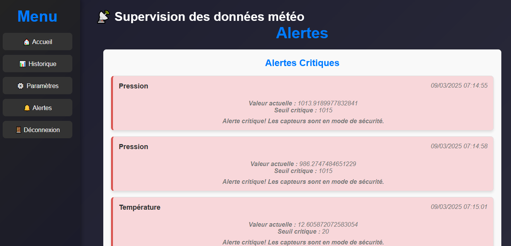

#  Nomac Supervisor

##  Description du projet

Nomac Supervisor est une application de supervision d'une station météo, permettant d'afficher et d'analyser les données météorologiques en temps réel.

##  Technologies utilisées

Frontend : React, Tailwind CSS 

Backend : Node.js, Express.js, MongoDB

Base de données : MongoDB 

#  Installation et exécution

##  Cloner le projet

git clone https://github.com/ihssane2002/Nomac-supervisor.git

cd Nomac-supervisor

#  Installer les dépendances

Backend :

cd backend
npm install

Frontend :
npm install

## 🚀 Lancer le projet

Backend :

Ouvrez deux terminaux :
Terminal 1 :
cd backend
node server.js
Terminal 2 :
cd backend
node server-auth.js

Ouvrez un troisième terminal :
npm start

L'application se lance sur : http://localhost:3000/

##  Fonctionnalités principales

Récupération et affichage des données météorologiques en temps réel

Dashboard interactif pour la supervision

API REST avec Express.js pour récupérer les données depuis MongoDB

Interface moderne et réactive avec React

Gestion des alertes pour les seuils critiques

